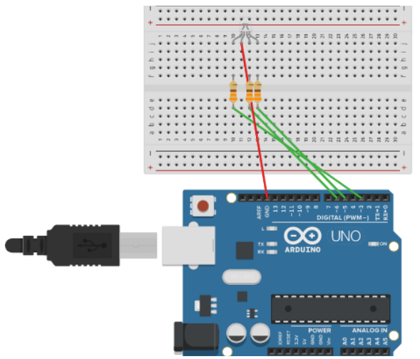

# Arduino-RGB-Led-Random-Color

Here we are looking at the RGB LED from a different perspective and make it blink with random colors.

Here is what we need for this project:
- Breadboard
- 3 x 323 &Omega; resistors
- 1 x RGB LED Diode (I used a common anode one, follow along if yours is a common cathode one)
- Jumper wires (for easy following, I use red wire to connect to the red pin, green wire to connect to the green pin, blue wire to connect to the blue pin and black wire for the 5V connection)

## Wiring

We will use Pulse Width Modulation (PWM), so we will need to use the pins with the PWM capability on Arduino.

Please use the following schematic to complete your wiring:



If you'd like to tinker, you can do so on my wiring on [TinkerCad](https://www.tinkercad.com/things/7viXGKdjw2L).


## Code

Now that our wiring is complete, we will control the pins with analog inputs. As always, we will initialize our pins as OUTPUT in our setup function first. Then, in our loop function we will create random integers between 0 and 255 as values for red, green and blue pins. We will create a small function to send the random values to the pins and call the function with the red, green and blue values.


> &#x1F92F; If you want to keep your sanity, be careful with what value brings your LED to ON and OFF. It might be that value 0 might be turning ON your LED and 255 might be turning it OFF.


In the function, note that we will use byte variable type, which is a special variable that accepts integers in the 0-255 range.

To make things further interesting, we are going to see what the random red, green and blue values are from the serial console.

```
const int red_pin = 3;
const int grn_pin = 5;
const int blu_pin = 6;
int wait = 2000;
int r;
int g;
int b;

void setup() 
{
  pinMode(red_pin, OUTPUT);
  pinMode(grn_pin, OUTPUT);
  pinMode(blu_pin, OUTPUT);
  Serial.begin(9600);
}

void loop() 
{
 r = rand() % 255 + 0;
 g = rand() % 255 + 0;
 b = rand() % 255 + 0;
 showColor(r, g, b);
 Serial.println(String(r) + " " + String(g) + " " + String(b));
 delay(wait);

}


void showColor(byte r, byte g, byte b)
{
  analogWrite(red_pin, r);
  analogWrite(grn_pin, g);
  analogWrite(blu_pin, b);
}
```

If you receive the following error in your Arduino IDE:

> Board at /dev/ttyACM0 is not available

and if you are on Linux, open up a terminal and run the ```cat /dev/ttyACM0``` command. Below is a simple output from my terminal, showing red, green and blue values on one line:


If you followed along so far, you would see that your RGB LED will light up with a different color every two seconds (int wait = 2000.)